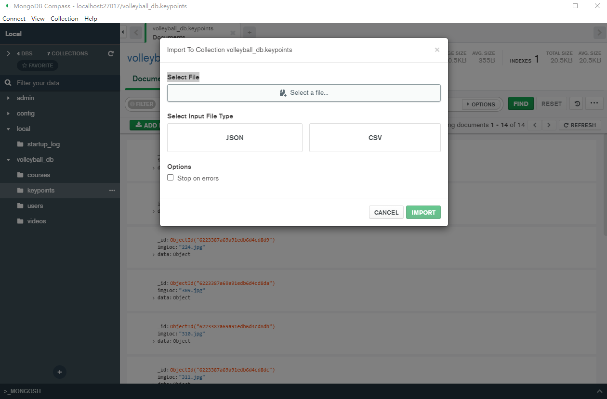

# Express Backend App

A Express Framework app

## Install the dependencies

```bash
npm install
// or
yarn
```

### Start the server (hot-code reloading, error reporting, etc.)

```bash
nodemon server.js
```

---

### Mongodb install

url: https://www.mongodb.com/try/download/tools

install Shell、 Compass 

Compass是图形化的管理界面，可以直接import进我导出的json文件


