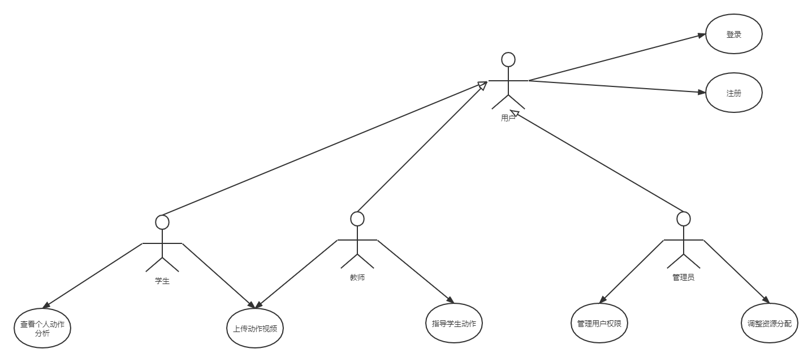

# 北航动作分析平台

## 简单的需求分析

### 功能需求

后续的扩展需求：声音提示？ 课上实时？

### 非功能需求

最好能有实时处理功能，学生接受反馈即时，效果更佳，但这样要求系统的响应时间和处理时间在较低的水平。

### 前后端交互 

后端如何处理？

输入：视频；

输出：评估和建议（响应情况下的正确的动作）

当前运行速度：11fps，怎样能实现实时处理的效果？

### 一些可能的困难

课上实时动态处理可能需要在一个大屏幕上进行系统的运转，同时摄像头在实时记录学生的动作，涉及硬件设备较多，如何降低时延？

