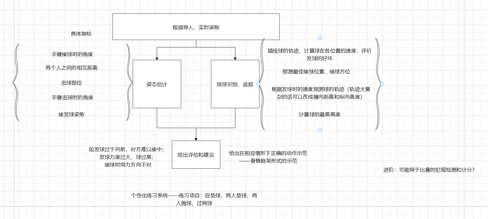

# 北航动作分析平台

## 简单的需求分析

### 功能需求

后续的扩展需求：声音提示？ 课上实时？

### 非功能需求

最好能有实时处理功能，学生接受反馈即时，效果更佳，但这样要求系统的响应时间和处理时间在较低的水平。

### 前后端交互 

后端如何处理？

输入：视频；

输出：评估和建议（响应情况下的正确的动作）

当前运行速度：11fps，怎样能实现实时处理的效果？

### 后端系统架构

### 一些可能的困难

课上实时动态处理可能需要在一个大屏幕上进行系统的运转，同时摄像头在实时记录学生的动作，涉及硬件设备较多，如何降低时延？

---

### version 1.0

先设计一个简单的在线姿态识别功能：
传入一段视频，可以在线播放相应的姿态识别后的视频

总体规划&需求分析：
1. 由于是课上使用，考虑安排一个用来课上展示的大屏幕，能够实时展示学生的动作情况（内容应该相对简洁明了，
不宜展示运动参数等不利于直观展示的东西。
2. 要求实时性，能够较快地对学生的动作给出分析。课上学生在训练一般不能直接看训练的分析，课下学生可以自行查看“自己”课上的训练情况，
同时展示相关数据，用于复盘。
3. 若有可能，考虑课上在手机端以语音形式给学生动作指示，以及错误的纠正建议。
4. 在接下来的时间，可能需要多调研相关体育类训练系统的实现范例，作为自身实践的指导。

